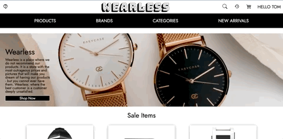

# Wearables

"Wearables" is an e-commerce website for wearable technology devices. The website is fully functional, allowing users to:

- browse all products in the database;
- add items in stock to the cart;
- review and edit cart before purchasing;
- submit an order, to be sent to the database.

Built over 5 days in July 2022 for the Concordia Web Development Bootcamp by Daoping Zheng, Gayathri Balasubramanian, Winston Leung, and myself. (I was the team lead, responsible for ensuring that the project was on track, communication was smooth, and all tasks were accounted for.)

STACK: React.Js, Node.Js (Express), MongoDB, CSS, HTML, and styled-components.

OTHER TOOLS USED: Figma, Trello
